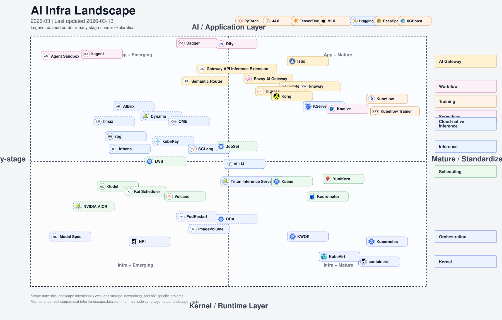

# AI-Infra Landscape & Learning Path 🚀

[中文版](./README.zh-CN.md) | English

Welcome to the **AI-Infra** repository! This project provides a curated
landscape and structured learning path for engineers building and operating
modern **AI infrastructure**, especially in the Kubernetes and cloud-native
ecosystem.

## 🌐 Overview

This landscape visualizes key components across the AI Infrastructure stack, mapped by:

- **Horizontal Axis (X):**
  - Left: Prototype / Early-stage projects
  - Right: Kernel & Runtime maturity

- **Vertical Axis (Y):**
  - Bottom: Infrastructure Layer (Kernel/Runtime)
  - Top: Application Layer (AI/Inference)

The goal is to demystify the evolving AI Infra stack and guide engineers on
where to focus their learning.

## 📑 Table of Contents

- [AI-Infra Landscape](#-ai-infra-landscape-2026-march)
- [AI Infra Definition](#-ai-infra-definition)
- [Learning Path for AI Infra Engineers](#-learning-path-for-ai-infra-engineers)
  - [0. Kernel & Runtime (底层内核)](#-0-kernel--runtime-底层内核)
  - [1. Scheduling & Workloads (调度与工作负载)](#-1-scheduling--workloads-调度与工作负载)
  - [2. Model Inference & Runtime Optimization (推理优化)](#-2-model-inference--runtime-optimization-推理优化)
  - [3. AI Gateway & Agentic Workflow](#-3-ai-gateway--agentic-workflow)
  - [4. Training on Kubernetes](#-4-training-on-kubernetes)
  - [5. Observability of AI Workloads](#-5-observability-of-ai-workloads)
  - [6. Ecosystem Initiatives](#6-ecosystem-initiatives)
- [RoadMap](#️-roadmap)
- [Contributing](#-contributing)
- [References](#-references)
- [Conferences](#conferences)
- [License](#-license)

## 🧩 AI Infra Definition

This repository uses the following long-term boundary for AI Infrastructure:

1. **Training**: distributed training system design and execution
   (`DP`/`TP`/`EP`/`SP`/`PP`), plus scheduling, runtime, and reliability.
2. **Inference (P/D)**: serving stack for prefill/decode workloads, including
   `KVCache`, PD disaggregation, model routing, and efficiency optimization.
3. **RL (training-serving consistency)**: policy loop, online/offline
   efficiency, and agentic workflow integration between training and inference.

Reference figure:

### 📂 Documentation Files

#### Kubernetes

- [Kubernetes Overview](./docs/kubernetes/README.md)
- [Kubernetes Learning Plan](./docs/kubernetes/learning-plan.md)
- [Pod Lifecycle](./docs/kubernetes/pod-lifecycle.md)
- [Pod Startup Speed](./docs/kubernetes/pod-startup-speed.md)
- [GPU Pod Cold Start](./docs/kubernetes/gpu-pod-cold-start.md)
- [Scheduling Optimization](./docs/kubernetes/scheduling-optimization.md)
- [TAS Validation Report](./docs/kubernetes/tas-validation.md)
- [Workload Isolation](./docs/kubernetes/isolation.md)
- [Dynamic Resource Allocation (DRA)](./docs/kubernetes/dra.md)
- [DRA Performance Testing](./docs/kubernetes/dra-performance-testing.md)
- [NVIDIA GPU Operator](./docs/kubernetes/nvidia-gpu-operator.md)
- [NVIDIA AI Cluster Runtime (AICR)](./docs/kubernetes/nvidia-aicr.md)
- [GPU Fault Detection and Self-Healing](./docs/kubernetes/gpu-fault-detection.md)
- [Node Resource Interface (NRI)](./docs/kubernetes/nri.md)
- [Large-Scale Clusters (130K+ Nodes)](./docs/kubernetes/large-scale-clusters.md)

#### Inference

- [Inference Overview](./docs/inference/README.md)
- [Model Architectures](./docs/inference/model-architectures.md)
- [LoRA: Low-Rank Adaptation](./docs/inference/lora.md)
- [Grove: Kubernetes Inference Orchestration](./docs/inference/grove.md)
- [AIBrix Platform](./docs/inference/aibrix.md)
- [OME Platform](./docs/inference/ome.md)
- [Serverless AI Inference](./docs/inference/serverless.md)
- [Model Switching & Dynamic Scheduling](./docs/inference/model-switching.md)
- [Prefill-Decode Disaggregation](./docs/inference/pd-disaggregation.md)
- [Caching Strategies](./docs/inference/caching.md)
- [Memory & Context DB](./docs/inference/memory-context-db.md)
- [Large-Scale MoE Models](./docs/inference/large-scale-experts.md)
- [Model Lifecycle Management](./docs/inference/model-lifecycle.md)
- [Performance Testing](./docs/inference/performance-testing.md)

#### Training

- [Training Overview](./docs/training/README.md)
- [Transformers](./docs/training/transformers.md)
- [PyTorch Ecosystem](./docs/training/pytorch-ecosystem.md)
- [Pre-Training](./docs/training/pre-training.md)
- [Parallelism Strategies](./docs/training/parallelism.md)
- [Kubeflow Training](./docs/training/kubeflow.md)
- [ArgoCD for GitOps](./docs/training/argocd.md)
- [MLOps](./docs/training/mlops.md)

#### Observability

- [Observability Overview](./docs/observability/README.md)

#### AI Agents

- [AI Agent Platforms and Frameworks](./agent-infra/README.md)
- [Production Agent Infra: 9 Layers + 4 Cross-Cutting Capabilities](./agent-infra/ai-agent-infra-9-layers-zh.md)

#### Blog

- [Blog List](./BLOG.md)

## 📊 AI-Infra Landscape (2026 March)

**Legend:**

> - Dashed outlines = Early stage or under exploration
> - Labels on right = Functional categories

Maintenance:
- Source data: `./diagrams/ai-infra-landscape.data.json`
- Generate SVG: `node ./scripts/generate-landscape-svg.js`

## 🎯 Goal Achievement Chart for Cloud Native AI Infra Architect

Inspired by Shohei Ohtani's goal achievement methodology, this chart outlines
the key practices and habits for becoming a successful Cloud Native AI
Infrastructure Architect. The chart is organized into nine core pillars:
**Kubernetes Core Skills**, **AI Workloads & GPU**, **AI Platform Architecture**,
**Industry Influence**, **Architecture Vision**, **Technical Leadership**,
**Self-Management**, **Family Time**, and **Long-term Thinking**.

|  |  |  | |  | | | | |
| --- | --- | --- | --- | --- | --- | --- | --- | --- |
| Agent Sandbox | New subproject updates | DRA + NRI | GPU CUDA | Reservation and Backfill | Model Switching | Inference Orchestration | Training Fault Recovery | Consider multi-tenant isolation solutions |
| API Server & ETCD & DRA Performance | **Kubernetes Core(KEPs & Coding)** | Security Upgrades | KV-cache / Prefill-Decode Summary | **AI Workloads & GPU** | Cold Start/Warm Pool | Cluster AutoScaler | **AI Platform Architecture** | Topology Management |
| Node/GPU Self-healing Exploration | Steering | kubeadm | Track new models & operator trends | LPU/TPU/NPU etc. | Acceleration Solutions Matrix | Co-Evolving | Public vs Private Cloud Differences | Observability |
| AI-Infra Repo Roadmap Maintenance | 2–3 Conference Talks/Year | Publish one technical long-form article monthly | **Kubernetes Core Skills** | **AI Workloads & GPU** | **AI Platform Architecture** | Multi-dimensional Cost Evaluation | Performance Quantification/Optimization | SLA Stability |
| English Proficiency (Blog) | **Industry Influence** | Conformance Certification | **Industry Influence** | **Cloud Native AI Infra on Kubernetes Lead** | **Architecture Vision** | Multi-cluster Solutions | **Architecture Vision** | Ultra-large Scale |
| New Contributor Orientation | CNCF Ambassador | | **Technical Leadership** | **Self-Management** | **Family Time** | Think about 3-year evolution roadmap | Agentic / Model Ecosystem Trends | Communication with external leads |
| Drive cross-company collaboration tasks | Learn to disagree gently but clearly | Cross-department Influence Enhancement | Ensure 7–8 hours of sleep | Exercise 3 times per week to maintain fitness | Quarterly OKR/Monthly Review/Top 5 Things | 1h daily quality time with daughter | Monthly date/long talk with my Wife | Support my wife's personal time/interests |
| Mentor Core Contributors Team Building | **Technical Leadership** | Long-term Thinking | Control information input & screen time | **Self-Management** | Long vacation to prevent burn-out | Plan holidays/anniversaries in advance | **Family Time** | Daughter growth records / Quarterly review |
| Cross-project Dependency Governance, Architecture Coordination | Governance | TOC | Reading + Knowledge Base Accumulation | Reduce sugary drinks | Work like an efficiency Agent | Quarterly family travel budget(10%) & planning | Reserve time for family & rest | Annual family activity with parents |

## 🧭 Learning Path for AI Infra Engineers

### 📦 0. Kernel & Runtime (底层内核)

Core Kubernetes components and container runtime fundamentals. Skip this
section if using managed Kubernetes services.

- **Key Components:**
  - **Core**: Kubernetes, CRI, containerd, KubeVirt
  - **Networking**: CNI (focus: RDMA, specialized devices)
  - **Storage**: CSI (focus: checkpointing, model caching, data management)
  - **Tools**: KWOK (GPU node mocking), Helm (package management)

- **Learning Topics:**
  - Container lifecycle & runtime internals
  - Kubernetes scheduler architecture
  - Resource allocation & GPU management
  - For detailed guides, see [Kubernetes Guide](./docs/kubernetes/README.md)

---

### 📍 1. Scheduling & Workloads (调度与工作负载)

Advanced scheduling, workload orchestration, and device management for AI
workloads in Kubernetes clusters.

- **Key Areas:**
  - **Batch Scheduling**: Kueue, Volcano, koordinator, Godel, YuniKorn
    ([Kubernetes WG Batch](https://github.com/kubernetes/community/blob/master/wg-batch/README.md))
  - **GPU Scheduling**: HAMI, NVIDIA Kai Scheduler
  - **Inference Orchestration**: Grove (hierarchical gang scheduling, topology-aware placement)
  - **GPU Management**: NVIDIA GPU Operator, NVIDIA DRA Driver, Device Plugins,
    NVIDIA AICR
  - **Workload Management**: LWS (LeaderWorkset), Pod Groups, Gang Scheduling,
    WAS (Workload Aware Scheduling)
  - **Device Management**: DRA, NRI
    ([Kubernetes WG Device Management](https://github.com/kubernetes/community/blob/master/wg-device-management/README.md))
  - **Checkpoint/Restore**: GPU checkpoint/restore for fault tolerance and
    migration (NVIDIA cuda-checkpoint, AMD AMDGPU plugin via CRIU)

- **Learning Topics:**
  - Job vs. pod scheduling strategies (binpack, spread, DRF)
  - Queue management & SLOs
  - Multi-model & multi-tenant scheduling

**See [Kubernetes Guide](./docs/kubernetes/README.md)** for comprehensive coverage
of pod lifecycle, scheduling optimization, workload isolation, and resource
management. Detailed guides:
[Kubernetes Learning Plan](./docs/kubernetes/learning-plan.md) |
[Pod Lifecycle](./docs/kubernetes/pod-lifecycle.md) |
[Pod Startup Speed](./docs/kubernetes/pod-startup-speed.md) |
[Scheduling Optimization](./docs/kubernetes/scheduling-optimization.md) |
[Isolation](./docs/kubernetes/isolation.md) |
[DRA](./docs/kubernetes/dra.md) |
[DRA Performance Testing](./docs/kubernetes/dra-performance-testing.md) |
[NVIDIA GPU Operator](./docs/kubernetes/nvidia-gpu-operator.md) |
[NVIDIA AICR](./docs/kubernetes/nvidia-aicr.md) |
[NRI](./docs/kubernetes/nri.md)

- **RoadMap:**
  - Kubernetes v1.35 WAS Intro:
    [Introducing Workload Aware Scheduling](https://kubernetes.io/blog/2025/12/29/kubernetes-v1-35-introducing-workload-aware-scheduling/)
  - Gang Scheduling in Kubernetes [#4671](https://github.com/kubernetes/enhancements/pull/4671)
  - LWS Gang Scheduling [KEP-407](https://github.com/kubernetes-sigs/lws/blob/main/keps/407-gang-scheduling/README.md)

---

### 🧠 2. Model Inference & Runtime Optimization (推理优化)

LLM inference engines, platforms, and optimization techniques for efficient
model serving at scale.

- **Key Topics:**
  - Model architectures (Llama 3/4, Qwen 3, DeepSeek-V3, Flux)
  - Efficient transformer inference (KV Cache, FlashAttention, CUDA Graphs)
  - LLM serving and orchestration platforms
  - Serverless AI inference (Knative, AWS SageMaker, cloud platforms)
  - Multi-accelerator optimization
  - MoE (Mixture of Experts) architectures
  - Model lifecycle management (cold-start, sleep mode, offloading)
  - AI agent memory and context management
  - Performance testing and benchmarking

- **RoadMap:**
  - [Serving WG](https://github.com/kubernetes/community/blob/master/wg-serving/README.md)

**See [Inference Guide](./docs/inference/README.md)** for comprehensive coverage of
engines (vLLM, SGLang, Triton, TGI), platforms (Dynamo, AIBrix, OME,
Kthena, KServe), serverless solutions (Knative, AWS SageMaker), and deep-dive
topics: [Model Architectures](./docs/inference/model-architectures.md) |
[AIBrix](./docs/inference/aibrix.md) |
[Serverless](./docs/inference/serverless.md) |
[P/D Disaggregation](./docs/inference/pd-disaggregation.md) |
[Caching](./docs/inference/caching.md) |
[Memory/Context DB](./docs/inference/memory-context-db.md) |
[MoE Models](./docs/inference/large-scale-experts.md) |
[Model Lifecycle](./docs/inference/model-lifecycle.md) |
[Performance Testing](./docs/inference/performance-testing.md)

---

### 🧩 3. AI Gateway & Agentic Workflow

AI Gateways provide routing, load balancing, and management for LLM APIs,
while Agentic Workflow platforms enable building autonomous AI systems that
can perceive, reason, and act.

- **Projects to Learn:**
  - AI Gateway:
    - [`Gateway API Inference Extension`](https://github.com/kubernetes-sigs/gateway-api-inference-extension)
    - [`Envoy AI Gateway`](https://github.com/envoyproxy/ai-gateway)
    - [`Istio`](https://github.com/istio/istio)
    - [`KGateway`](https://github.com/kgateway-dev/kgateway): previously known as Gloo.
    - [`DaoCloud knoway`](https://github.com/knoway-dev/knoway)
    - [`Higress`](https://github.com/alibaba/higress): Alibaba
    - [`Kong`](https://github.com/Kong/kong)
    - [`Semantic Router`](https://github.com/vllm-project/semantic-router): vLLM Project
  - Native Agent Kits:
    - **VolcEngine Native AI Agent Kit** (ByteDance): Comprehensive platform
      with MCP support, elasticity, memory management, and full observability
  - Kubernetes-Native Agent Platforms:
    - [`KAgent`](https://github.com/kagent-dev/kagent): CNCF Sandbox - K8s-native
      agent orchestration
    - [`Volcano AgentCube`](https://github.com/volcano-sh/agentcube): Agent
      orchestration in Volcano ecosystem
    - [`Volcano Kthena`](https://github.com/volcano-sh/kthena): Advanced agent
      scheduling in Volcano
    - [`KubeEdge Sedna`](https://github.com/kubeedge/sedna): Edge-cloud
      collaborative AI with federated learning
    - [`Kubernetes SIG Agent Sandbox`](https://github.com/kubernetes-sigs/agent-sandbox):
      Secure sandbox for AI agents
    - [`Agent Substrate`](https://github.com/agent-substrate/substrate):
      Core system and high-density Kubernetes runtime for stateful agent actors with
      suspend/resume and real-time routing
    - [`Agent Infra Sandbox`](https://github.com/agent-infra/sandbox): Community
      sandbox infrastructure
    - [`OpenKruise Agents`](https://github.com/openkruise/agents): Application
      lifecycle agent operations
    - [`ArgoCD Agent`](https://github.com/argoproj-labs/argocd-agent): Agent-based
      GitOps deployments
  - Agent Development Frameworks:
    - [`LangChain DeepAgents`](https://github.com/langchain-ai/deepagents):
      Deep reasoning and multi-agent systems
    - [`Dify`](https://github.com/langgenius/dify): LLMOps platform for
      agent applications
    - [`AgentScope`](https://github.com/agentscope-ai/agentscope): Multi-agent
      development framework
    - [`Dapr Agents`](https://github.com/dapr/dapr-agents): Cloud-native
      agent primitives with Dapr
    - [`Coze Studio`](https://github.com/coze-dev/coze-studio): Visual
      agent design environment
    - [`Open-AutoGLM`](https://github.com/zai-org/Open-AutoGLM): Autonomous
      agent framework
    - [`Spring AI Alibaba`](https://github.com/alibaba/spring-ai-alibaba):
      Spring Boot agent integration
    - [`Google ADK-Go`](https://github.com/google/adk-go): Go-native agent
      development kit
    - [`Dagger`](https://github.com/dagger/dagger): Programmable CI/CD
      for agents
  - Agent Infrastructure:
    - [`kube-agentic-networking`](https://github.com/kubernetes-sigs/kube-agentic-networking):
      Agentic networking policies and governance for agents and tools in
      Kubernetes
    - **Model Context Protocol (MCP)**: Agent-to-agent communication standard
      (CNCF Tech Radar 2025: Adopt)
    - **Agent2Agent (A2A)**: Direct agent communication patterns
    - **ACP (Agent Communication Protocol)**: Multi-agent communication standard
  - Serverless:
    - [`Knative`](https://github.com/knative/serving): Serverless solution, like [llama stack use case](https://github.com/knative/docs/blob/071fc774faa343ea996713a8750d78fc9225356c/docs/blog/articles/ai_functions_llama_stack.md).

- **Learning Topics:**
  - API orchestration for LLMs
  - Prompt routing and A/B testing
  - RAG workflows, vector DB integration
  - Agent architecture patterns (perception, reasoning, action, memory)
  - **Four-stage agent evolution** (human goals/planning → AI-assisted
    planning → AI-learned planning → fully autonomous)
  - Multi-agent collaboration and communication
  - Agent security and sandboxing
  - MCP and agent protocol standards
  - Agent observability and monitoring
  - Edge-cloud collaborative AI and federated learning

- **Community Initiatives:**
  - [CNCF Agentic System Initiative](https://github.com/cncf/toc/issues/1746)
  - [WG AI Integration](https://github.com/kubernetes/community/blob/master/wg-ai-integration/charter.md)
  - [CNCF Tech Radar 2025](https://radar.cncf.io/) - Agentic AI Platforms section

**See [AI Agent Platforms Guide](./agent-infra/README.md)** for comprehensive
coverage of agent platforms, frameworks, MCP protocol, agent infrastructure
components, and detailed learning paths for building and deploying AI agents
on Kubernetes. For the production layered architecture, see
[Agent Infra 9 Layers + 4 Cross-Cutting Capabilities](./agent-infra/ai-agent-infra-9-layers-zh.md).

---

### 🎯 4. Training on Kubernetes

Distributed training of large AI models on Kubernetes with fault tolerance,
gang scheduling, and efficient resource management.

- **Key Topics:**
  - **Transformers: Standardizing model definitions across the PyTorch
    ecosystem**
  - PyTorch ecosystem and accelerator integration (DeepSpeed, vLLM, NPU/HPU/XPU)
  - Distributed training strategies (data/model/pipeline parallelism)
  - Gang scheduling and job queueing
  - Fault tolerance and checkpointing
  - GPU error detection and recovery
  - Training efficiency metrics (ETTR, MFU)
  - GitOps workflows for training management
  - Storage optimization for checkpoints
  - **Pre-training large language models (MoE, DeepseekV3, Llama4)**
  - **Scaling experiments and cluster setup (AMD MI325)**
  - **MLOps: Repeatable, auditable, and rollback-capable ML lifecycle**

**See [Training Guide](./docs/training/README.md)** for comprehensive coverage of
training operators (Kubeflow, Volcano, Kueue), ML platforms (Kubeflow
Pipelines, Argo Workflows), GitOps (ArgoCD), fault tolerance strategies,
ByteDance's training optimization framework, and industry best practices.
Detailed guides: [Transformers](./docs/training/transformers.md) |
[PyTorch Ecosystem](./docs/training/pytorch-ecosystem.md) |
[Pre-Training](./docs/training/pre-training.md) |
[Parallelism Strategies](./docs/training/parallelism.md) |
[Kubeflow](./docs/training/kubeflow.md) | [ArgoCD](./docs/training/argocd.md) |
[MLOps](./docs/training/mlops.md)

---

### 🔍 5. Observability of AI Workloads

Comprehensive monitoring, metrics, and observability across the AI
infrastructure stack for production operations.

- **Key Topics:**
  - **Infrastructure monitoring**: GPU utilization, memory, temperature, power
  - **GPU fault detection**: XID errors, card dropout, link failures, automated
    recovery
  - **Inference metrics**: TTFT, TPOT, ITL, throughput, request latency
  - **Scheduler observability**: Queue depth, scheduling latency, resource
    allocation
  - **LLM application tracing**: Request traces, prompt performance, model
    quality
  - **Cost optimization**: Resource utilization analysis and right-sizing
  - **Multi-tenant monitoring**: Per-tenant metrics and fair-share enforcement

**See [Observability Guide](./docs/observability/README.md)** for comprehensive
coverage of GPU monitoring (DCGM, Prometheus), inference metrics (OpenLLMetry,
Langfuse, OpenLit), scheduler observability (Kueue, Volcano), distributed
tracing (DeepFlow), and LLM evaluation platforms (TruLens, Deepchecks).

For GPU fault detection and self-healing, see the
[GPU Fault Detection Guide](./docs/kubernetes/gpu-fault-detection.md).

- **Featured Tools:**
  - OpenTelemetry-native: <a href="https://github.com/openlit/openlit">`OpenLit`</a>,
    <a href="https://github.com/traceloop/openllmetry">`OpenLLMetry`</a>
  - LLM platforms: <a href="https://github.com/langfuse/langfuse">`Langfuse`</a>,
    <a href="https://github.com/truera/trulens">`TruLens`</a>
  - Model validation: <a href="https://github.com/deepchecks/deepchecks">`Deepchecks`</a>
  - Network tracing: <a href="https://github.com/deepflowio/deepflow">`DeepFlow`</a>
  - Infrastructure: <a href="https://github.com/okahu">`Okahu`</a>

---

### 6. Ecosystem Initiatives

- **Projects to Learn:**
  - [`Model Spec`](https://github.com/modelpack/model-spec): CNCF Sandbox
  - [`ImageVolume`](https://github.com/kubernetes/enhancements/tree/master/keps/sig-node/4639-oci-volume-source)
  - [`Pod In-place Resize`](https://kubernetes.io/docs/tasks/configure-pod-container/resize-container-resources)

---

## 🗺️ RoadMap

For planned features, upcoming topics, and discussion on what may or may not be
included in this repository, please see the [RoadMap](./RoadMap.md).

The roadmap has been updated to focus on the **AI Native era** (2025-2035),
addressing key challenges including:

- AI Native Platform: Model/Agent as first-class citizens
- Resource Scheduling: DRA, heterogeneous computing, topology awareness
- Runtime Evolution: Container + WASM + Nix + Agent Runtime
- Platform Engineering 2.0: IDP + AI SRE + Security + Cost + Compliance
- Security & Supply Chain: Full-chain governance of AI assets
- Open Source & Ecosystem: Upstream collaboration in AI Infra

## 🤝 Contributing

We welcome contributions to improve this landscape and path! Whether it's a new project, learning material, or diagram update — please open a PR or issue.

## 📚 References

- [CNCF Landscape](https://landscape.cncf.io/)
- [Awesome LLMOps](https://awesome-llmops.inftyai.com/)
- [Open Infra Index](https://github.com/deepseek-ai/open-infra-index)
- [InfraTech](https://github.com/CalvinXKY/InfraTech)
- [AI Infra Learning](https://github.com/cr7258/ai-infra-learning)
- [AI Infra Learning Docs](https://github.com/ai-infra-learning/docs)
- [Awesome AI Infrastructures](https://github.com/1duo/awesome-ai-infrastructures)
- [AI Infra Landscape](https://github.com/tensorchord/ai-infra-landscape)
- [Awesome LLMOps (GitHub)](https://github.com/InftyAI/Awesome-LLMOps)
- [AI Fundermentals](https://github.com/ForceInjection/AI-fundermentals)
- [CNCF TAG Workloads Foundation](https://github.com/cncf/toc/blob/main/tags/tag-workloads-foundation/README.md)
- [CNCF TAG Infrastructure](https://github.com/cncf/toc/blob/main/tags/tag-infrastructure/README.md)
- [CNCF AI Initiative](https://github.com/cncf/toc/issues?q=is%3Aissue%20state%3Aopen%20label%3Akind%2Finitiative)
- Kubernetes [WG AI Gateway](https://github.com/kubernetes/community/blob/master/wg-ai-gateway/README.md)
- Kubernetes [WG AI Conformance](https://github.com/kubernetes/community/blob/master/wg-ai-conformance/README.md)
- Kubernetes [WG AI Integration](https://github.com/kubernetes/community/blob/master/wg-ai-integration/README.md)
- [CNCF Agentic System Initiative](https://github.com/cncf/toc/issues/1746)
- [CNCF Tech Radar 2025](https://radar.cncf.io/) - Agentic AI Platforms

If you have some resources about AI Infra, please share them in [#8](https://github.com/pacoxu/AI-Infra/issues/8).

For AI Agent projects and developments, see [#30](https://github.com/pacoxu/AI-Infra/issues/30).

### [Conferences](https://github.com/pacoxu/developers-conferences-agenda)

Here are some key conferences in the AI Infra space:

- AI_dev: for instance, [AI_dev EU 2025](https://aideveu2025.sched.com/)
- [PyTorch Conference](https://pytorch.org/pytorchcon/) by PyTorch Foundation
- KubeCon+CloudNativeCon AI+ML Track, for instance, [KubeCon NA 2025](https://events.linuxfoundation.org/kubecon-cloudnativecon-north-america/program/schedule-at-a-glance/) and co-located events [Cloud Native + Kubernetes AI Day](https://events.linuxfoundation.org/kubecon-cloudnativecon-north-america/co-located-events/cloud-native-kubernetes-ai-day/)
- AICon in China by QCon.
- GOSIM(Global Open-Source Innovation Meetup): for instance, [GOSIM Hangzhou 2025](https://hangzhou2025.gosim.org/)

## 📜 License

Apache License 2.0.

---

_This repo is inspired by the rapidly evolving AI Infra stack and aims to help engineers navigate and master it._
