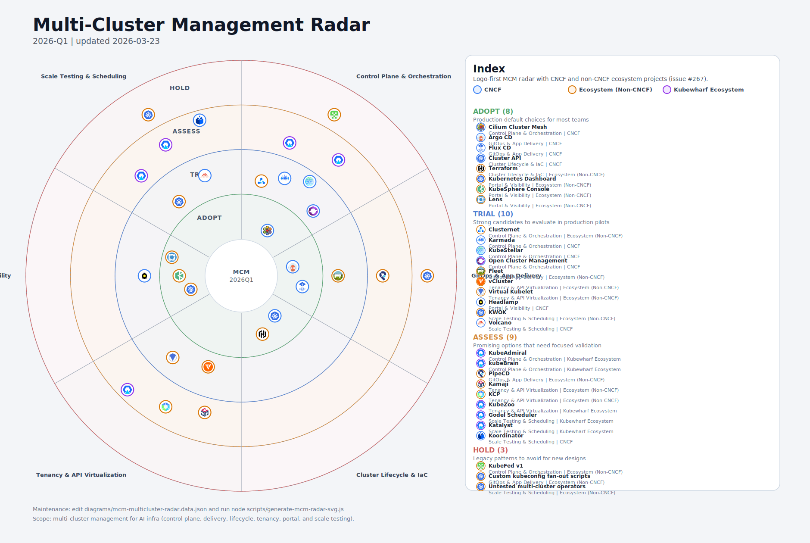

# AI Infra 时代的多租户隔离性方案探讨

[English Version](./multi-tenancy-isolation.md)

## 引言

随着 AI 基础设施规模的扩大以支持训练和推理等多样化工作负载,多租户隔离已成为关键的架构问题。公有云和私有云
部署之间,以及训练和推理工作负载之间的需求存在显著差异。本文档探讨针对这些场景的隔离策略。

## 公有云 vs 私有云:训练与推理的考量点

下表突出显示了不同云类型和工作负载类别在 AI 基础设施设计和运营方面的主要差异:

| 维度 / 场景 | 公有云 · 训练 | 私有云 · 训练 | 公有云 · 推理 | 私有云 · 推理 |
| --- | --- | --- | --- | --- |
| **典型场景** | 短期大规模预训练、微调、超参搜索;算完就删集群 | 企业内部长期训练、多人多团队共享 GPU 资源池 | 面向公网/多 Region 用户的大模型 API、AIGC 服务 | 内网问答、办公助手、知识库、业务系统智能化 |
| **资源 & 弹性** | GPU 弹性好;支持大规模临时集群;大量用 Spot/Preemptible | 固定 GPU 池;强调排班和配额;多型号、多厂商混部 | 自动扩缩容,按 QPS/并发扩缩;多 Region 部署 | 规模相对可控;可能是 1-2 个机房,多集群多租户 |
| **成本思路** | OPEX 为主;关注单次大作业总成本;靠折扣+Spot 降本 | CapEx 为主;关键是长期 GPU 利用率 ≥60-70% | 低谷少副本,高峰扩容;避免长时间闲置 GPU | GPU 买来就在那;用多租户、多模型、批处理填满空闲 |
| **调度 & 平台** | Kueue/Volcano/Ray 等做 elastic & 抢占容错;可直接用云托管训练服务 | Gang 调度、优先级、quota 管理;强 topo 感知(NVLink/RDMA/MIG/vGPU) | 云托管网关、LB、监控、托管推理平台(Bedrock/Vertex/SageMaker…) | 自建 KServe/vLLM/Ray Serve/Triton 等;结合现有网关、监控、审计体系 |
| **数据 & 存储** | 数据多在对象存储;跨 AZ/Region 要考虑带宽和流量成本;频繁 checkpoint 到对象存储 | 数据在企业数据湖 / HDFS / Ceph / MinIO;机房级 topo 感知,训练靠近数据 | RAG 索引、向量库多用托管存储服务;多 Region 数据复制 | 自建向量库(Milvus/Qdrant/pgvector…);所有数据留在内网闭环 |
| **SLO / 可靠性** | 训练可容忍抢占;重点是 checkpoint + 自动恢复;容忍任务被打散重跑 | 训练任务长;更多考虑维护窗口、迁移和 reschedule | P95/P99 延迟、多 Region 容灾、灰度发布、A/B 实验 | 内网低延迟、高稳定;与现有业务 SLO 统一(如核心交易链路) |
| **安全 & 合规** | 注重跨国/跨 Region 合规(GDPR 等);大量用云 KMS、WAF、审计服务 | 满足本地监管及企业内部规范;物理隔离 + 网络分区 | 对外 API 要有风控、防滥用、防数据泄露;依赖云安全服务 | 全链路内网;严格 RBAC、审计、脱敏;通常不上公网 |
| **主要挑战** | 抢算力、配额限制;成本随规模不可控;架构容易被云产品 lock-in | 多团队抢 GPU、如何公平又高利用;硬件拓扑复杂、需要深度调度改造 | 全球流量调度、跨 Region 性能 & 成本;依赖云闭源能力 | 组件自己拼、自己运维;同时兼顾合规、安全与算力利用率 |

### 关键洞察

**公有云训练**:

- 针对突发工作负载优化,具有弹性资源
- Spot 实例降低成本但需要容错设计
- 托管服务简化运维但可能导致供应商锁定

**私有云训练**:

- 专注于最大化固定 GPU 资产的利用率
- 多租户调度,公平性和优先级执行
- 强拓扑感知对 RDMA、NVLink 和 MIG 至关重要

**公有云推理**:

- 为全球用户群提供自动扩缩容和多区域部署
- 托管推理平台减少运维开销
- 通过基于流量模式的动态副本扩缩进行成本控制

**私有云推理**:

- 与企业安全和合规框架集成的自托管解决方案
- 强调内网安全和 RBAC
- 模型生命周期管理和多模型服务以最大化 GPU 投资回报

## Kubernetes 多租户集群在离线混部场景下的容器安全隔离方案

在多租户 Kubernetes 集群中运行混合在线/离线工作负载需要分层隔离策略。以下是主要方法,从强到基础隔离。

### 1. 最强隔离:集群 / 控制平面隔离

**方法**:为不互信的租户提供独立的 Kubernetes 集群或控制平面。

**优势**:

- 完全的 API 服务器、etcd 和调度器隔离
- 在控制平面级别消除嘈杂邻居问题
- 简化安全审计和合规性

**使用场景**:

- 相互不信任的租户(例如,公有云中的不同企业)
- 需要物理或逻辑隔离的监管要求

**考量因素**:

- 更高的运维开销(需要管理多个集群)
- 资源利用效率降低
- 基础设施成本增加

**相关项目**:

- <a href="https://github.com/kubernetes-sigs/cluster-api">Cluster API</a>: 声明式集群生命周期管理
- <a href="https://github.com/kubernetes-sigs/hierarchical-namespaces">Hierarchical Namespaces</a>:
  单集群内的虚拟集群抽象

### 2. 强隔离:节点池 / 物理资源隔离

**方法**:为租户或工作负载类型分配专用节点池。

**优势**:

- CPU、内存、GPU 资源的硬边界
- 防止租户之间的内核级干扰
- 简化容量规划和配额执行

**使用场景**:

- 具有严格 SLA 要求的混合在线/离线工作负载
- GPU 密集型 AI 训练 vs CPU 密集型 Web 服务

**实现**:

```yaml
# 带有污点的专用工作负载节点池
apiVersion: v1
kind: Node
metadata:
  name: gpu-node-01
  labels:
    workload-type: ai-training
    tenant: team-a
spec:
  taints:
  - key: workload-type
    value: ai-training
    effect: NoSchedule
```

```yaml
# 带有容忍度的 Pod 调度到专用节点
apiVersion: v1
kind: Pod
metadata:
  name: training-job
spec:
  tolerations:
  - key: workload-type
    operator: Equal
    value: ai-training
    effect: NoSchedule
  nodeSelector:
    workload-type: ai-training
    tenant: team-a
  containers:
  - name: trainer
    resources:
      limits:
        nvidia.com/gpu: "8"
```

**考量因素**:

- 如果管理不当可能导致资源碎片化
- 需要强大的配额和调度策略

**相关项目**:

- <a href="https://github.com/kubernetes/autoscaler/tree/master/cluster-autoscaler">Cluster Autoscaler</a>:
  根据需求自动扩缩节点池
- <a href="https://github.com/koordinator-sh/koordinator">Koordinator</a>: 具有 QoS 保证的混部调度

### 3. 运行时隔离:沙箱运行时

沙箱运行时通过添加额外的安全层(通过轻量级虚拟机或用户空间内核)提供比标准容器运行时更强的隔离。

#### 3.1 gVisor:应用内核 / 系统调用拦截

<a href="https://gvisor.dev/">gVisor</a> 实现了一个用户空间内核,用于拦截和处理系统调用,减少内核攻击面。

**关键特性**:

- 用 Go 编写的用户空间内核
- 系统调用过滤和验证
- OCI 兼容(通过 RuntimeClass 与 Kubernetes 集成)
- **gVisor 快照**:预热容器状态以实现快速冷启动

**使用场景**:

- 仅 CPU 的 AI agent 工作负载
- 不受信任的代码执行(例如,LLM 生成的代码)
- 具有安全要求的无服务器函数

**限制**:

- 不支持 GPU
- 系统调用拦截带来的性能开销
- 某些系统调用未实现

**配置**:

```yaml
# gVisor 的 RuntimeClass
apiVersion: node.k8s.io/v1
kind: RuntimeClass
metadata:
  name: gvisor
handler: runsc
---
# 使用 gVisor 的 Pod
apiVersion: v1
kind: Pod
metadata:
  name: agent-workload
spec:
  runtimeClassName: gvisor
  containers:
  - name: agent
    image: python:3.11-slim
    command: ["python", "agent.py"]
```

**相关项目**:

- <a href="https://github.com/google/gvisor">gVisor</a>
- <a href="https://cloud.google.com/blog/products/containers-kubernetes/agentic-ai-on-kubernetes-and-gke">
  GKE Agent Sandbox</a>: 生产就绪的 gVisor,带有快照(冷启动速度提升 90%)

#### 3.2 Kata Containers:轻量级虚拟机 / 每个 Pod 独立内核

<a href="https://katacontainers.io/">Kata Containers</a> 在轻量级虚拟机中运行每个 Pod,提供硬件级隔离。

**关键特性**:

- 硬件虚拟化(KVM、Firecracker、Cloud Hypervisor)
- 每个 Pod 内核隔离
- GPU 直通支持(VFIO)
- OCI 兼容

**使用场景**:

- GPU 密集型 AI 训练和推理
- 具有不受信任模型的多租户推理
- 需要虚拟机级隔离的合规要求

**优势**:

- 强安全边界(硬件隔离)
- GPU 性能接近原生
- 与现有 Kubernetes 工作负载兼容

**配置**:

```yaml
# Kata Containers 的 RuntimeClass
apiVersion: node.k8s.io/v1
kind: RuntimeClass
metadata:
  name: kata
handler: kata
---
# 使用 Kata 隔离的 GPU 工作负载
apiVersion: v1
kind: Pod
metadata:
  name: secure-inference
spec:
  runtimeClassName: kata
  containers:
  - name: model-server
    image: pytorch/torchserve:latest
    resources:
      limits:
        nvidia.com/gpu: "1"
```

**AI 工作负载的 Kata vs gVisor 对比**:

| 特性 | Kata Containers | gVisor |
| --- | --- | --- |
| GPU 支持 | ✅ 是 | ❌ 否 |
| 开销 | 低(接近原生) | 中等(系统调用拦截) |
| 启动时间 | 快(< 1秒) | 非常快(使用快照 < 100毫秒) |
| 内存开销 | 每个虚拟机 ~130MB | 每个沙箱 ~15MB |
| 安全模型 | 硬件隔离 | 软件隔离 |
| AI 使用场景 | GPU 训练/推理 | 仅 CPU 的 agent 工作负载 |

**相关项目**:

- <a href="https://github.com/kata-containers/kata-containers">Kata Containers</a>
- <a href="https://github.com/firecracker-microvm/firecracker">Firecracker</a>: AWS 的轻量级虚拟机

### 4. 机密计算:Confidential Containers

**方法**:使用基于硬件的可信执行环境(TEE)加密使用中的数据。

**关键技术**:

- **Intel SGX/TDX**:可信执行飞地
- **AMD SEV/SEV-ES/SEV-SNP**:加密虚拟机内存
- **ARM TrustZone**:安全执行环境
- **Confidential Containers**:CNCF 基于 TEE 的容器隔离项目

**优势**:

- 保护敏感模型和数据免受云提供商侵害
- 防御内存抓取和侧信道攻击
- 符合数据主权法规

**使用场景**:

- 公有云中的私有 AI 模型
- 具有严格隐私要求的医疗保健和金融 AI 工作负载
- 具有加密梯度的联邦学习

**相关项目**:

- <a href="https://github.com/confidential-containers/confidential-containers">Confidential Containers</a>:
  CNCF 沙箱项目
- <a href="https://github.com/occlum/occlum">Occlum</a>: 机密计算的 TEE 操作系统

### 5. 基础:容器 / Pod 安全约束

这些是适用于所有多租户 Kubernetes 部署的基线安全实践。

**关键机制**:

- **Pod 安全标准**:执行特权、基线或受限策略
- **SecurityContext**:runAsNonRoot、readOnlyRootFilesystem、capabilities drop
- **网络策略**:限制 Pod 到 Pod 的通信
- **ResourceQuotas**:限制每个命名空间的 CPU、内存、GPU
- **LimitRanges**:默认资源请求/限制

**示例**:

```yaml
# 执行 Pod 安全标准
apiVersion: v1
kind: Namespace
metadata:
  name: tenant-a
  labels:
    pod-security.kubernetes.io/enforce: restricted
    pod-security.kubernetes.io/audit: restricted
    pod-security.kubernetes.io/warn: restricted
---
# 租户命名空间的 ResourceQuota
apiVersion: v1
kind: ResourceQuota
metadata:
  name: tenant-a-quota
  namespace: tenant-a
spec:
  hard:
    requests.cpu: "100"
    requests.memory: "200Gi"
    requests.nvidia.com/gpu: "10"
    limits.cpu: "200"
    limits.memory: "400Gi"
```

**相关项目**:

- <a href="https://kubernetes.io/docs/concepts/security/pod-security-standards/">Pod Security Standards</a>
- <a href="https://www.openpolicyagent.org/docs/latest/kubernetes-introduction/">OPA Gatekeeper</a>: 策略执行
- <a href="https://kyverno.io/">Kyverno</a>: Kubernetes 原生策略管理

### 6. 网络和存储隔离

**网络隔离**:

- **网络策略**:执行租户级分段
- **服务网格**:mTLS、流量加密、可观测性
- **CNI 插件**:Calico、Cilium、Weave 用于多租户

**存储隔离**:

- **StorageClasses**:每个租户的专用存储层
- **卷快照**:租户特定的备份策略
- **静态加密**:具有加密支持的 CSI 驱动程序

**示例**:

```yaml
# 网络策略:默认拒绝所有入口
apiVersion: networking.k8s.io/v1
kind: NetworkPolicy
metadata:
  name: deny-all-ingress
  namespace: tenant-a
spec:
  podSelector: {}
  policyTypes:
  - Ingress
---
# 允许来自同一命名空间的特定入口
apiVersion: networking.k8s.io/v1
kind: NetworkPolicy
metadata:
  name: allow-same-namespace
  namespace: tenant-a
spec:
  podSelector: {}
  policyTypes:
  - Ingress
  ingress:
  - from:
    - podSelector: {}
```

**相关项目**:

- <a href="https://github.com/projectcalico/calico">Calico</a>: 网络策略和安全
- <a href="https://cilium.io/">Cilium</a>: 基于 eBPF 的网络和安全
- <a href="https://istio.io/">Istio</a>: 带有 mTLS 的服务网格

## Agent Sandbox:多租户 AI Agent 执行的进展

执行 LLM 生成代码的 AI agent 需要强隔离,以防止不受信任的代码危害集群或访问敏感数据。

### Kubernetes Agent Sandbox Warm Pool

**Kubernetes Agent Sandbox Warm Pool** 模式通过维护预初始化的沙箱环境池来解决 AI agent 的冷启动问题。

**关键概念**:

- **预热沙箱**:随时可用的 gVisor 或 Kata 容器池
- **快速分配**:亚秒级将沙箱分配给传入的 agent 请求
- **生命周期管理**:自动清理和补充沙箱池
- **资源效率**:平衡池大小和资源浪费

**架构**:

```text
┌─────────────────────────────────────────────────────────┐
│                   Agent 请求                            │
└─────────────────────┬───────────────────────────────────┘
                      │
                      ▼
┌─────────────────────────────────────────────────────────┐
│              Warm Pool 控制器                           │
│  ┌──────────┐  ┌──────────┐  ┌──────────┐             │
│  │ Sandbox 1│  │ Sandbox 2│  │ Sandbox 3│ ... (池)    │
│  └──────────┘  └──────────┘  └──────────┘             │
└─────────────────────┬───────────────────────────────────┘
                      │ (分配)
                      ▼
┌─────────────────────────────────────────────────────────┐
│         Sandbox 执行 (gVisor/Kata)                      │
│  - 执行 LLM 生成的代码                                  │
│  - 执行资源限制                                         │
│  - 应用网络策略                                         │
└─────────────────────────────────────────────────────────┘
                      │
                      ▼ (清理 & 回收)
```

**优势**:

- **降低延迟**:消除冷启动开销(使用 gVisor 快照可提升 90%)
- **安全性**:为不受信任的代码提供强隔离
- **可扩展性**:使用预分配资源处理突发流量

**挑战**:

- **资源开销**:空闲沙箱消耗内存和 CPU
- **池管理**:调整池大小以平衡延迟和成本
- **多租户**:确保共享池中租户之间的严格隔离

**实施考虑**:

- 对仅 CPU 的 agent 工作负载使用 gVisor 快照(最快)
- 对 GPU 加速的 agent 工作负载使用 Kata Containers
- 为严格的隔离要求实施租户特定的池
- 监控池利用率并根据需求自动扩缩

### Agent Sandbox 的公有云 vs 私有云考虑因素

**公有云**:

- 更高的安全要求(不受信任的外部用户)
- 依赖托管服务(GKE Agent Sandbox)
- 根据全球流量模式自动扩缩预热池
- 通过动态池大小进行成本优化

**私有云**:

- 受控用户群(内部员工)
- 自托管沙箱解决方案(自定义预热池)
- 基于可预测使用模式的固定池大小
- 与企业 RBAC 和审计系统集成

**参考**:

- <a href="https://cloud.google.com/blog/products/containers-kubernetes/agentic-ai-on-kubernetes-and-gke">
  GKE Agent Sandbox: Agentic AI 的强大保障</a>

## 多集群应用管理

随着 AI 基础设施的扩展,跨多个 Kubernetes 集群管理工作负载对于灾难恢复、地理分布和工作负载隔离至关重要。

### 多集群管理雷达图 (GitHub 可维护版, CNCF + 生态项目)

为了方便在 GitHub 里通过 PR 持续维护,这里改为仓库内的数据驱动 SVG,不再依赖外链附件图片。

这个版本在 CNCF 基础上补充了 issue #267 提到的非 CNCF 项目:

- 多集群控制面: Karmada、Clusternet、Fleet、Open Cluster Management、KubeAdmiral
- 交付与生命周期: Argo CD、Flux CD、Cluster API、Terraform、PipeCD
- 多租户与 API 虚拟化: Virtual Kubelet、vCluster、KCP、Kamaji、KubeZoo
- 门户与运维压力点: Lens、Headlamp、Kubernetes Dashboard、KubeSphere Console、KWOK
- Kubewharf 体系: kubeBrain、KubeAdmiral、KubeZoo、Godel Scheduler、Katalyst



维护方式:

- 数据源: `diagrams/mcm-multicluster-radar.data.json`
- 生成命令: `node scripts/generate-mcm-radar-svg.js`

### 多租户范围

不同的多集群解决方案提供不同级别的隔离,如多租户范围图所示:


**命名空间** (最弱隔离):

- 共享集群,共享控制平面
- 最低开销,最高资源效率
- 适合受信任的内部团队

**命名空间即服务**:

- 物理集群内的虚拟集群
- 使用命名空间级 RBAC 简化多租户
- 项目:<a href="https://github.com/loft-sh/vcluster">vCluster</a>,
  <a href="https://github.com/kubernetes-sigs/cluster-api-provider-nested">Kamaji</a>

**Kubernetes API 即服务**:

- 具有共享工作节点的托管控制平面
- 示例:<a href="https://github.com/kubernetes-sigs/cluster-api-provider-nested/tree/main/controlplane">Capsule</a>,
  <a href="https://github.com/kubernetes-sigs/cluster-api">KCP</a>

**控制平面即服务 (内部)**:

- 每个租户具有隔离控制平面的共享管理平面
- 项目:<a href="https://github.com/kcp-dev/kcp">k3k</a>,<a href="https://github.com/loft-sh/vcluster">HNC</a>

**控制平面即服务 (外部)**:

- 每个租户完全控制平面隔离
- 项目:<a href="https://github.com/loft-sh/vcluster">vCluster (外部模式)</a>,
  <a href="https://github.com/kcp-dev/kcp">Kamaji (外部)</a>

**专用集群** (最强隔离):

- 每个租户独立的 Kubernetes 集群
- 最高安全性,最高运维开销
- 不受信任的多租户所需

### AI Infra 的关键多集群使用场景

**地理分布**:

- 在靠近用户的地方部署推理服务(多区域)
- 符合数据驻留法规

**灾难恢复**:

- 跨集群复制关键 AI 工作负载
- 高可用性推理服务的故障转移

**工作负载隔离**:

- 训练 vs 推理的独立集群
- 将敏感模型与通用工作负载隔离

**资源优化**:

- 在高峰需求期间将工作负载突发到公有云
- 使用本地集群处理基线工作负载

**参考**:

- <a href="https://www.cncf.io/reports/cncf-technology-radar/">CNCF 技术雷达图</a>

## 多租户 AI 基础设施的最佳实践

### 分层防御策略

结合多种隔离机制进行纵深防御:

1. **集群隔离**:将不受信任的租户分离到专用集群
2. **节点池隔离**:为关键工作负载提供专用 GPU 节点
3. **运行时隔离**:agent 工作负载使用 gVisor,GPU 工作负载使用 Kata
4. **网络隔离**:网络策略和服务网格
5. **存储隔离**:每个租户的加密持久卷

### 工作负载特定隔离

根据安全要求匹配隔离强度:

| 工作负载类型 | 推荐隔离 | 理由 |
| --- | --- | --- |
| 内部训练 | 标准 (cgroups + 命名空间) | 受信任用户,性能优先 |
| 多租户推理 | 增强 (Kata Containers) | 不受信任的模型,需要 GPU |
| AI Agent 执行 | 强 (gVisor 带快照) | 不受信任的代码,仅 CPU |
| 机密模型 | 最大 (Confidential Containers) | 监管合规,需要 TEE |

### 监控和审计

多租户安全的全面可观测性:

- **资源使用**:跟踪每个租户的 CPU、GPU、内存、存储消耗
- **安全事件**:特权升级、策略违规的审计日志
- **隔离违规**:命名空间违规、系统调用异常的告警
- **成本归因**:公平资源分配的计费模型

**工具**:

- <a href="https://github.com/falcosecurity/falco">Falco</a>: 运行时安全监控
- <a href="https://github.com/aquasecurity/tracee">Tracee</a>: 基于 eBPF 的安全可观测性
- <a href="https://github.com/cilium/tetragon">Tetragon</a>: 基于 eBPF 的安全和策略执行

### 公有云 vs 私有云总结

**公有云**:

- 更强的隔离要求(不受信任的租户)
- 托管服务减少运维负担(GKE、EKS、AKS)
- 自动扩缩容和动态资源分配
- 符合全球法规(GDPR、SOC2)

**私有云**:

- 受控用户群(内部员工)
- 与企业集成的自托管解决方案
- 需要高效调度的固定资源池
- 严格的内部安全策略和 RBAC

## 结论

AI 基础设施中的多租户隔离需要一种平衡安全性、性能和运维复杂性的细致方法。公有云和私有云部署有不同的要求,
训练和推理工作负载也是如此。通过分层隔离机制 — 从集群分离到沙箱运行时 — 并使策略与特定用例保持一致,
组织可以构建安全、高效和可扩展的 AI 平台。

## 参考资料

- <a href="https://kubernetes.io/docs/concepts/security/multi-tenancy/">Kubernetes 多租户</a>
- <a href="https://www.cncf.io/blog/2023/12/15/container-isolation-gone-wrong/">CNCF: 容器隔离</a>
- <a href="https://gvisor.dev/">gVisor 官方网站</a>
- <a href="https://katacontainers.io/">Kata Containers 官方网站</a>
- <a href="https://github.com/confidential-containers/confidential-containers">Confidential Containers</a>
- <a href="https://cloud.google.com/blog/products/containers-kubernetes/agentic-ai-on-kubernetes-and-gke">
  GKE Agent Sandbox</a>
- <a href="https://www.cncf.io/reports/cncf-technology-radar/">CNCF 技术雷达图</a>
- <a href="https://mp.weixin.qq.com/s/W189KuI4QG3WEhsDLov31A">模型 - 多租户安全隔离</a>

---

_多租户隔离是一个不断发展的领域。随着 AI 工作负载的扩展和新安全威胁的出现,隔离策略将继续适应。
本文档反映了截至 2025 年 12 月的最佳实践。_
