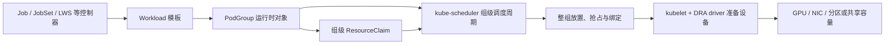

# Kubernetes v1.37：DRA 走向平滑迁移，WAS 核心能力进入 Beta

> 本文基于 2026-08-25 的 `release-1.37` 分支、KEP 状态和发布说明草稿整理。
> Kubernetes v1.37.0 预计于 2026-08-26 发布；正式发布前仍可能出现阶段或默认值调整，
> 生产升级应以最终 CHANGELOG、特性门控定义和官方发布公告为准。

Kubernetes v1.37 计划包含 67 项增强：16 项 Stable、23 项 Beta、27 项 Alpha，
以及 1 项弃用或移除。对 AI Infra 团队，最重要的不是增强数量，而是两条开始汇合的主线：

- **Dynamic Resource Allocation（DRA）**继续补齐从 Device Plugin 平滑迁移、设备故障隔离、
  共享容量、分区设备和拓扑表达。
- **Workload-Aware Scheduling（WAS）**的 Workload/PodGroup、Gang Scheduling 和
  工作负载感知抢占进入 Beta，使 kube-scheduler 开始按整组工作负载而非单个 Pod 决策。
- [KEP-5729](https://kep.k8s.io/5729) 把两条主线连接起来：PodGroup 可以共享
  ResourceClaim，避免为每个成员 Pod 重复创建和预留设备声明。

## DRA：从设备分配 API 走向生产迁移与精细管理

### Stable / GA：迁移、状态与故障隔离

| KEP | v1.37 阶段 | AI Infra 价值 |
| --- | --- | --- |
| [5004](https://kep.k8s.io/5004) Extended Resources via DRA | GA | 保留 `nvidia.com/gpu: N` 等工作负载接口，同时把后端逐步切换到 DRA。 |
| [5055](https://kep.k8s.io/5055) Device Taints and Tolerations | GA | 隔离单个故障或维护设备，不必因为一块卡而封锁整台节点。 |
| [4817](https://kep.k8s.io/4817) ResourceClaim Device Status | GA | driver 可在 claim status 中报告设备状态和标准化网络数据，利于 RDMA/NIC 集成。 |
| [6072](https://kep.k8s.io/6072) Standard `numaNode` Attribute | Stable | 用统一属性表达 NUMA 位置，让来自不同 driver 的 GPU、NIC、TPU 可以比较拓扑关系。 |

Extended Resource 兼容路径是本次 DRA 最直接的生产信号。平台可以让旧 YAML 保持不变，
按节点池或设备类型逐步将分配后端从 Device Plugin 迁到 DRA。迁移期允许集群内不同节点
使用不同后端，但**同一节点上的同名资源不能同时由 Device Plugin 和 DRA 提供**。

这条路径适合先解决“旧应用如何迁移”，而 ResourceClaim 仍用于拓扑、共享容量、
多设备组合等需要 DRA 完整表达力的新工作负载。

### Beta：把分配、准备、共享和容器消费串起来

| KEP | v1.37 阶段 | 作用 |
| --- | --- | --- |
| [5729](https://kep.k8s.io/5729) ResourceClaim Support for Workloads | Beta | 为 PodGroup 生成并共享一份 claim，突破逐 Pod `reservedFor` 的规模限制。 |
| [5304](https://kep.k8s.io/5304) Device Attributes Downward API | Beta | 通过 CDI 元数据把 PCI 地址、MAC 等 driver 生成的信息交给容器。 |
| [5075](https://kep.k8s.io/5075) Consumable Capacity | Beta | 多个 claim 可从同一设备消费带宽、显存等容量份额。 |
| [4815](https://kep.k8s.io/4815) Partitionable Devices | Beta | 表达 GPU/TPU 分区、多主机逻辑设备及其拓扑。 |
| [5007](https://kep.k8s.io/5007) Device Binding Conditions | Beta | 外部设备准备完成后再绑定 Pod；准备失败或超时可重新调度。 |

[KEP-4680](https://kep.k8s.io/4680) Resource Health Status 的最终阶段仍需在正式发布时复核：
当前 `release-1.37` 代码将其保留为 Beta 且默认启用，但发布公告草稿曾将其列为 Stable。
它关注 Pod/容器状态中的设备健康；不要与已经 GA、用于 driver 回写 claim 设备状态的
KEP-4817 混为一谈。

### Alpha：复杂设备模型仍在快速演进

v1.37 的 DRA Alpha 工作主要探索以下问题：

- [KEP-5491](https://kep.k8s.io/5491)：设备属性支持列表值，表达多个 PCIe root 等关系。
- [KEP-5517](https://kep.k8s.io/5517)：让 DRA 管理的 CPU/内存参与常规 scheduler 与
  kubelet 资源核算。
- [KEP-5677](https://kep.k8s.io/5677)：在节点和 ResourceSlice 视图中展示资源池剩余容量。
- [KEP-5945](https://kep.k8s.io/5945)：无需节点初始化的资源可跳过 prepare/unprepare。
- [KEP-6080](https://kep.k8s.io/6080)：用 CEL 派生和归一化不同 driver 的设备属性。
- [KEP-5963](https://kep.k8s.io/5963)：用兼容组在调度阶段排除互斥的设备分区模式。
- [KEP-6132](https://kep.k8s.io/6132)：通过 PreQueueingHints 只重新排队真正受
  ResourceClaim 变化影响的 Pod；该能力因缺陷从原计划 Beta 调整回 Alpha。

这些能力默认关闭，API 仍可能变化。生产试点应优先验证已经进入 Beta/GA 的迁移、
故障隔离、状态、共享容量与绑定链路，再单独评估 Alpha 设备模型。

## WAS：从逐 Pod 调度转向整组工作负载

### Workload、PodGroup 和 Gang Scheduling 进入 Beta

[KEP-4671](https://kep.k8s.io/4671) 将 Workload 与 PodGroup 核心 API 推进到
`scheduling.k8s.io/v1beta1`。Workload 描述模板和调度意图，PodGroup 保存一组 Pod 的
运行时状态。启用 Gang policy 后，scheduler 先检查至少 `minCount` 个成员能否一起放下，
再把整组统一调度和绑定。

v1.37 还带来三项重要变化：

1. PodGroup 成为调度队列中的一等对象，组内 Pod 共享等待、退避和调度周期。
2. `minCount` 可以调整，为弹性训练和批任务扩缩最小可运行规模提供基础。
3. `GangScheduling`、`WorkloadAwarePreemption` 旧门控合并到 Beta 门控
   `GenericWorkload`；该门控在 v1.37 **仍默认关闭**。

Beta 表示 API 和实现成熟度提升，不表示升级后集群会自动切换为工作负载级调度。

### 工作负载感知抢占进入 Beta

[KEP-5710](https://kep.k8s.io/5710) 不再只为单个高优先级 Pod 腾位置，而是计算整个
PodGroup 达到 `minCount` 并满足放置约束所需的空间。调度器会复用一次完整放置求解的结果，
减少 victim reprieve 阶段的重复计算；普通 Pod 抢占也会识别 PodGroup 的 disruption mode，
避免错误地拆掉要求整体中断的工作负载。

Beta API 将 disruption mode 统一为 `All` / `Single`，以便 PodGroup 和分层结构复用。
Alpha 门控 `PodGroupPreemptionPolicy` 可进一步控制一个 PodGroup 是否允许主动抢占其他负载。

### 分层工作负载仍是 Alpha

现代 AI 任务常常不是单层 worker 集合。例如分离式推理可能包含 prefill、decode、路由和缓存组。
v1.37 用以下 Alpha 能力开始表达这种结构：

- [KEP-6012](https://kep.k8s.io/6012) `CompositePodGroup`：把 PodGroup 组织成树，
  父组用 `minGroupCount` 约束子组，叶子组用 `minCount` 约束 Pod。
- [KEP-5732](https://kep.k8s.io/5732) Topology-Aware Workload Scheduling：
  支持“可用区 → 机架”等多层放置约束。
- [KEP-6089](https://kep.k8s.io/6089) Controller Integration APIs：为 JobSet、
  LeaderWorkerSet、RayJob 等控制器提供可复用的 policy、topology、disruption 和
  ResourceClaim building blocks；它不表示这些控制器已经自动完成接入。
- [KEP-5547](https://kep.k8s.io/5547) Job integration：原生 Job 控制器可实验性使用
  `.spec.scheduling`，但仍是 Alpha，且依赖 `WorkloadWithJob`。

### DRA 与 WAS 的连接点

KEP-5729 的关键不是“Pod 终于能使用 DRA”——单 Pod 早已可以——而是让一个 PodGroup
共享 claim 生命周期和 reservation。对大规模训练或分离式推理，这可以：

- 避免每个成员各建一份本应共享的设备声明；
- 避免 `status.reservedFor` 为大量 Pod 逐项登记；
- 让 topology unit、RDMA 接口或共享 GPU 分区跟随工作负载组创建和回收。

如果 `DRAWorkloadResourceClaims` 未启用，v1.37 不会把本应由 PodGroup 共享的模板静默
退化成每 Pod 一份 claim，以免错误复制稀缺资源请求。

### v1.37 WAS 特性门控

| 特性门控 | 阶段 / 默认值 | 组件 | 能力 |
| --- | --- | --- | --- |
| `GenericWorkload` | Beta / 关闭 | apiserver、controller-manager、scheduler | Workload、PodGroup、Gang Scheduling、工作负载感知抢占 |
| `DRAWorkloadResourceClaims` | Beta / 关闭 | apiserver、controller-manager、scheduler、kubelet | PodGroup 共享 ResourceClaim |
| `PodGroupPreemptionPolicy` | Alpha / 关闭 | apiserver、scheduler | PodGroup 主动抢占策略 |
| `TopologyAwareWorkloadScheduling` | Alpha / 关闭 | apiserver、scheduler | 单层和多层拓扑放置 |
| `CompositePodGroup` | Alpha / 关闭 | apiserver、controller-manager、scheduler | 分层工作负载 |
| `WorkloadWithJob` | Alpha / 关闭 | apiserver、controller-manager | Job `.spec.scheduling` 集成 |

## 其他与 AI Infra 直接相关的变化

- **Memory QoS（Beta）**：基于 cgroup v2 的 `memory.min`、`memory.low`、
  `memory.high` 提供保护和节流；仍需通过 kubelet 配置确定实际策略。
- **Pod Level Resource Managers（Beta，默认关闭）**：Topology、CPU、Memory Manager
  可以围绕 Pod 级资源请求做 NUMA 对齐和共享池划分，并依赖 `PodLevelResources`。
- **HPA Scale to Zero（Beta）**：Object/External metrics 可以把工作负载从 0 拉起；
  不适用于依赖运行中 Pod 的 CPU/内存指标。
- **Rootless Kubelet（Beta）**：门控可用不等于节点会自动 rootless；CRI、CNI、挂载、
  systemd 和设备访问仍需发行版级配置。
- **控制面恢复和 Watch 优化**：Resilient Watch Cache Initialization GA，配合并发
  watch 解码和 Etcd RangeStream，降低大集群 API Server 启动/恢复压力。
- **Pod-Level Checkpoint / Restore（Alpha）**：对长训练迁移和取证有潜力，但仍依赖
  CRIU、运行时、内核和安全边界，不应直接视为生产容灾能力。

## 升级风险与检查项

1. **迁移 WAS Alpha 对象**：`scheduling.k8s.io/v1alpha2` 已移除；升级前清理或迁移
   v1.36 的 Workload/PodGroup，并把旧门控切换为 `GenericWorkload`。不要假设
   `v1alpha2` 与 `v1alpha3`/`v1beta1` 能自动转换或安全回退。
2. **核对 SELinux 卷行为**：`SELinuxMount` 进入 GA 后，启用该能力的 CSI driver 会优先
   使用 mount option；共享卷上的不同 SELinux label 可能冲突。必要时为 Pod 显式设置
   `seLinuxChangePolicy: Recursive`。
3. **迁移 kubeadm 配置**：`v1beta3` 被移除，升级前用兼容版本的
   `kubeadm config migrate` 转成 `v1beta4`。
4. **检查 Static Pod**：Static Pod 不再允许通过 `secretRef`、`configMapRef` 等字段引用
   API 对象，配置应改为节点本地文件或静态挂载。
5. **开始退出 IPVS**：kube-proxy IPVS 在 v1.37 进入明确弃用告警周期；建立 nftables
   或 iptables 对照测试，不再依赖空的隐式 `mode`。
6. **验证 DRA/WAS 组合故障**：至少覆盖 driver 重启、ResourceSlice 重建、设备不健康、
   绑定超时、PodGroup 缩放、共享 claim 回收、抢占和回滚。

## 建议的试点顺序

1. 用独立 GPU 节点池验证 Extended Resource 经 DRA 后端分配，保留工作负载 YAML。
2. 接入设备 taint、claim status、Pod health 和 PodResources，先打通可观测与故障处置。
3. 在专用批处理集群启用 `GenericWorkload`，只验证无 DRA 的 Gang Scheduling 与抢占。
4. 再启用 `DRAWorkloadResourceClaims`，测试 PodGroup 共享 GPU 分区、RDMA/NIC 或拓扑 claim。
5. 最后单独评估 CompositePodGroup、多层拓扑与 Job 集成等 Alpha 能力。

已经使用 Kueue、Volcano 或自研调度器的平台，应先明确“准入排队与配额、Gang、节点放置、
设备分配”分别由谁负责，避免两套系统同时控制同一决策层。

## 参考

- 本文主要参考：[DaoCloud Kubernetes v1.37 发布说明](https://github.com/DaoCloud-OpenSource/docs/blob/main/kubernetes/sig-release/v1.37/release.md)
- [Kubernetes v1.37 Sneak Peek](https://kubernetes.io/blog/2026/07/31/kubernetes-v1-37-sneak-peek/)
- [Kubernetes v1.37 CHANGELOG](https://github.com/kubernetes/kubernetes/blob/master/CHANGELOG/CHANGELOG-1.37.md)
- [Kubernetes v1.37 release notes draft](https://github.com/kubernetes/sig-release/blob/master/releases/release-1.37/release-notes/release-notes-draft.md)
- [Kubernetes v1.36: Advancing Workload-Aware Scheduling](https://kubernetes.io/blog/2026/05/13/kubernetes-v1-36-advancing-workload-aware-scheduling/)
- [Kubernetes v1.36: More Drivers, New Features, and the Next Era of DRA](https://kubernetes.io/blog/2026/05/07/kubernetes-v1-36-dra-136-updates/)
